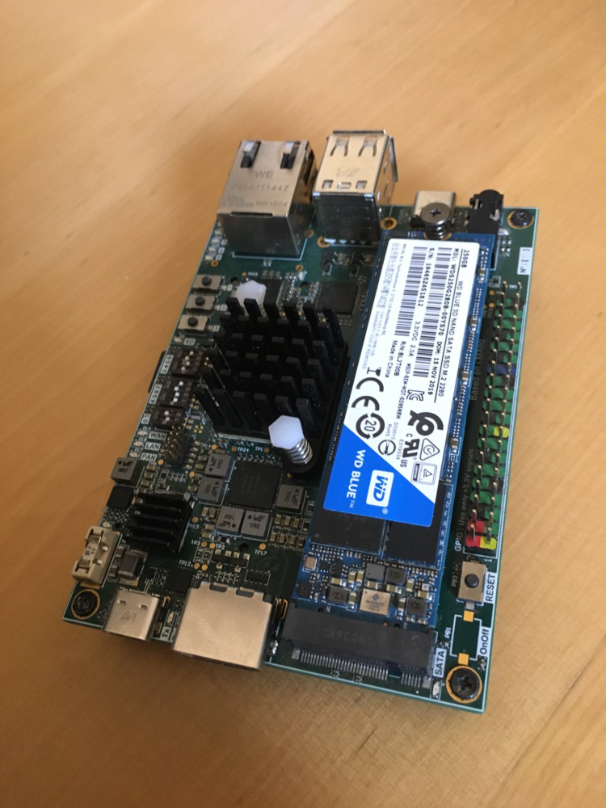

# Bourgeon - A fully open source SBC based on i.MX6Q

Bourgeon is a single board computer based on [i.MX6Q](https://www.nxp.com/products/processors-and-microcontrollers/arm-processors/i-mx-applications-processors/i-mx-6-processors/i-mx-6quad-processors-high-performance-3d-graphics-hd-video-arm-cortex-a9-core:i.MX6Q), a quad-core arm cortex A9 processor with 2Go of DDR3 RAM.
This project has been realised for learning purposes only.

_**A developpement board is functionnal, after applying hardware patches.**_

## Hardware specification

#### Connectivity :
- 2 USB type A ports
- 1 USB type C OTG port 
- 1 RJ45 10/100/1000 BASE-T ethernet
- 1 M.2 SATA connector 
- 1 SD card slot
- 1 HDMI port
- 1 GPIO raspberry pi compatible connector
- 1 USB type C debug and power port
- 1 mPCIe (with sim card available)
- 1 audio jack 3.5mm
- M.2 non-standard board to board connector, with UART, CAN, SPI, eMMC 8bits, I2C, GPIO...

#### Included memory :
- 8MB Flash NOR via SPI
- 64kB Eeprom via I2C
- 2GB DDR3 RAM 64 bits

## Software

Check boot log file for more detais.

#### Boot

This board uses [u-boot](https://www.denx.de/project/u-boot/), the sources files will be available in src/uboot.

#### linux kernel

The entire board image is under development, and not all hardware is currently supported.

Working and tested :
- RAM
- Sata
- mPCIe
- USB Host
- USB debug
- SD card slot
- Ethernet 10/100/1000BASE-T
- Audio codec SGTL500 
- And some miscellaneous function like DVFS, etc...

## Errata

Criticity level :

1 - Board can't work at all - critical

2 - Board function non-operational

3 - Board or board function must be improved

4 - Minor modification needed

- 1 p7 : Differential main ram clock signals DRAM_CLKO_N inverted 
- 1 global : No boot at ambient temperature, but work perfectly after a warm-up time (1min). Cold boot work (-10°C), but board hangs when the temperature is near 20°C 
- 2 p16 : UART TxD and RxD inverted, debug UART can't work properly
- 2 p16/p5 : USB D+ and D- pin inverted, debug UART can't work properly
- 3 p16 : CP2102N is switched off when the reset PB is pressed. Power supply must be changed to +5V except VIO, must be powered from +3.3V_DEBUG
- 3 global : For a full load, the CPU temperature can rise up to 90°C (too much)
- 3 p16 : CTS and RTS must be functional
- 3 p10 : GPIO wrong power domain, gpio 25, 23, 10, 26 are 2,5V instead of 3.3V
- 3 p8 : Bad phy reference ! No documentation about how to change the output clock from 25MHz to 125MHz, finally found solution on texas forum, but it's a non-standard solution !!! Thanks Ti !  
- 4 p7 : Readability, design note "not used" is at the wrong place
- 4 p1 : Readability, Table of content must be improved, more coherent order, add color...
- 4 p4 : Readability, PMIC schemtic must be more readable
- 4 p7 : Readability, decoupling capacitors name is not readable
- 4 p16 : Need two "No ERC" for U12 p18-19
- 4 global : link between pages (yellow arrows with net name) have no up to date location
- 4 global : Net color must be included in pdf files for more readability
- 4 p18 : R174 is too low, must be 1kOhm
- 4 p16 : usb lanes to usb connector routing pattern must be improved
- 4  global : Change ESD diode for generic 0402 package
- 4 p5 : change 0805 22µF capacitors for same reference as 0603 22µF (lower voltage ratings)
- 4 p2 p9 : Wrong I2C EEPROM addresses
- 4 p2 : Wrong I2C audio codec addresses
